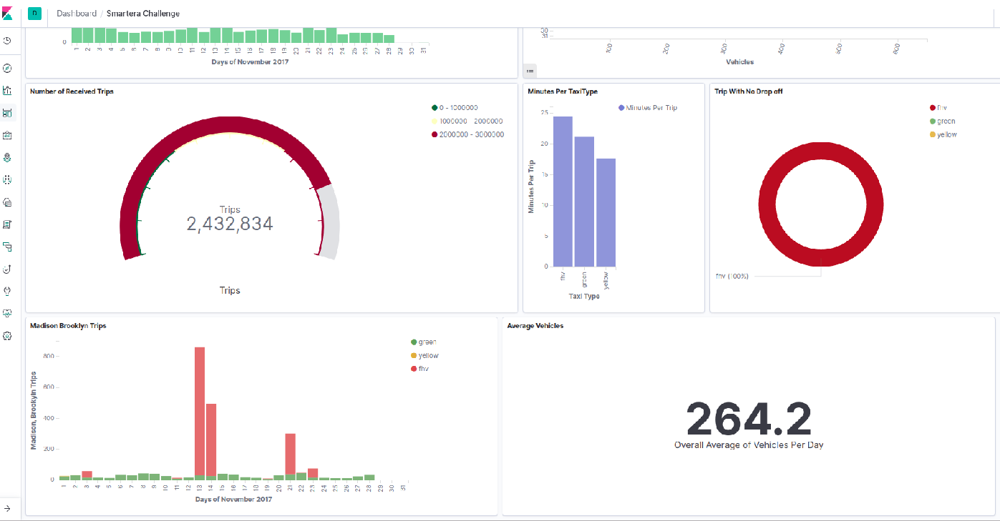

<h1 align = "center">NYC Taxi November 2017 Data Analysis</h1>

<h3 align = "center">Here You Can see The Whole Dashboard</h3>

<h3 align = "center">This graph shows how many trips have been recieved each day in November 2017</h3>

<h3 align = "center">This shows number of distinct vehicles working each day in November 2017</h3>

<h3 align = "center">Average Number of Vehicles</h3>

<h3 align = "center">This graph shows number of Madison, Brooklyn Trips each day in November 2017 for each taxi Type</h3>

<h3 align = "center">Average Number of Minutes by each Taxi Type</h3>

<h3 align = "center">Trips Without Drop</h3>

# How to Run

- First of all, Get the server up and running
- Make Sure that you have Elasticsearch and Kibana installed on your machine
- Make Sure that you have Java 8 on your machine

### Dashboard Import

- open Elasticsearch server using [ sudo systemctl start elasticsearch.service ]
- open Kibana server using [ sudo systemctl start kibana ]

- go to localhost:5601

- navigate to Management Tab in Kibana

- Click on Saved Objects

- Click on Import

- Choose "SmarteraDashboard"

### Apache Flink Run

- Start The Server
- Open Intellij and Import the Project
- Go To StreamingJob Class
- Run

### Attached Result.txt file that contains a list of comma-separated numbers of required values in the following order

- total number of received records
- total number of trips
- average trips per day for the given month
- number of distinct vehicles
- total number of trips picked up from “Woodside,Queens” for all three taxi types
